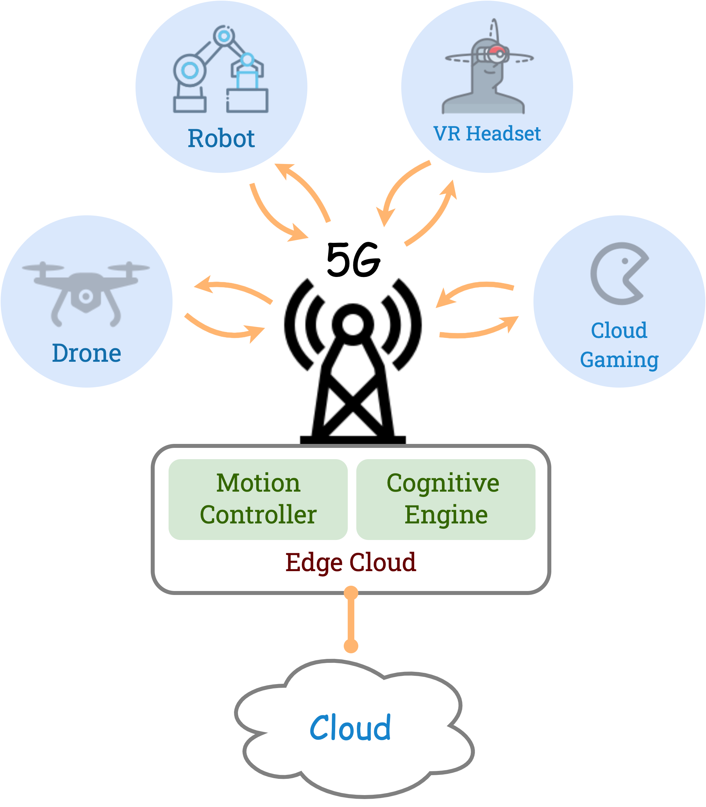
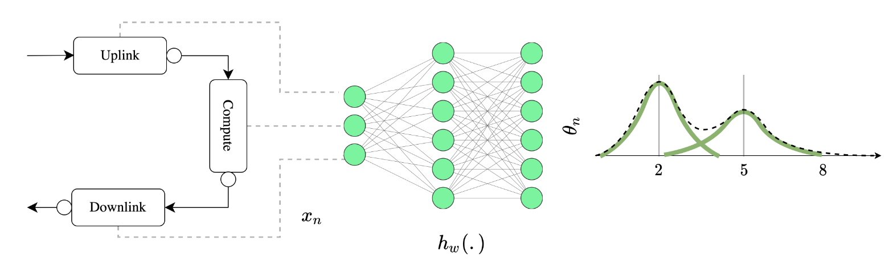

# Predicting 5G Network Responsiveness with Deep Learning

## Motivation

Latency-critical applications:
- Cyber-physical systems such as remote-controlled robotics systems
- Human-in-the-loop applications such as cloud gaming, augmented reality, and virtual reality 

The end nodes require a timely response from the server for smooth operation. 
Wireless: Shadowing, fading, and interference are stochastic phenomenons that cause transient high error rates, hence higher latencies.

To maintain the quality of service: 
- Wireless network must be tuned
- The application must adapt according to the delay conditions

A model that can predict the delay of the network is needed. 
Example: a remote-controlled robot can avoid high latency areas (probably because of poor radio coverage) in path planning.

End to end delay: probability density is important

## Approach

A deep learning-based probability prediction scheme will be devised for predicting the responsiveness or the end-to-end delay.
Conditioned on: SNR, RSSI, location, time, etc.

## Method

1. A survey on networked systems end-to-end delay prediction works (10%)
2. Propose an approach to use deep learning (10%)
3. Implement and validate the proposed scheme on the software-defined/private 5G network (80%)

## Implementation

1. Run Openairinterface5G network on the ExPECA testbed's software defined radios.
2. Develop a containerized software that collects the end-to-end delays to form the dataset for training the machine learning model.
3. Implement the machine learning application based on your proposed approach that can predict the end-to-end delay probabilities from the network state.
4. Collect end-to-end delay measurements and train the model.
5. Evaluate the model.

## Required Skills
Linux, Docker, Python

## References

https://github.com/samiemostafavi/autoran
https://github.com/samiemostafavi/pr3d
